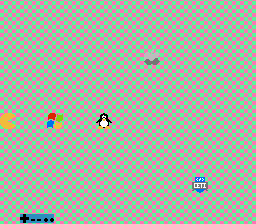

# Pac-Man


## Auteur
[David Brousseau](mailto:dbrsseau@gmail.com)

## Contexte académique
Projet effectué dans le cadre du cours **420-SE2-DM Système d'exploitation II**, remis à l'enseignant **Louis Marchand** au [Cégep de Drummondville](https://www.cegepdrummond.ca/) le 19 décembre 2014. Ce projet a été retranscris en décembre 2020 pour le rendre public et l'insérer dans mon porte-folio.

## Description
Reproduction partielle du jeu [Pac-Man](https://fr.wikipedia.org/wiki/Pac-Man) sur la première console de salon [Nintendo Entertainment System](https://fr.wikipedia.org/wiki/Nintendo_Entertainment_System). À noter qu'il n'y a aucune détection des collisions.

## Compatibilité
Testé sous des environnements **Linux** et **Windows** avec l'émulateur **FCEUX seulement**.

## Dépendances
- [NESASM](http://www.magicengine.com/mkit/), assembleur NES 6502 pour compiler le code.
- [FCEUX <sup>*</sup>](http://fceux.com/web/download.html), émulateur NES pour lancer le jeu.

_<sup>*</sup> Dépendance optionnelle selon votre utilisation._

## Environnement suggéré
- [VS Code](https://code.visualstudio.com/), éditeur de texte pour modifier le code.
    - [Retro Assembler](https://marketplace.visualstudio.com/items?itemName=EngineDesigns.retroassembler), extension pour le langage d'assembleur.
    - [TODO Highlight](https://marketplace.visualstudio.com/items?itemName=wayou.vscode-todo-highlight), extension pour afficher les TODOs.

## Fonctionnement
```
fceux bin/Pac-Man.nes
```

Joueur 1 :
> Utilisez le `pad directionnel` de votre manette pour déplacer Pac-Man.

Joueur 2 :
> Utilisez les boutons suivants pour permuter entre les logos.<br>
> `Bouton A` &rarr; Microsoft<br>
> `Bouton B` &rarr; Linux<br>
> `Select` &rarr; Apple<br>
> `Start` &rarr; Céti
>
> Utilisez le `pad directionnel` de votre manette pour déplacer le logo sélectionné.

## Références
- [6502.org](http://6502.org/tutorials/)
- [6502 Assembly](https://en.wikibooks.org/wiki/6502_Assembly)
- [6502 ASM, first app](https://taywee.github.io/NerdyNights/nerdynights/asmfirstapp.html)
- [NES ASM Tutorial](https://patater.com/gbaguy/nesasm.htm)
- [NES Basics and Our First Game](http://thevirtualmountain.com/nes/2017/03/08/nes-basics-and-our-first-game.html)
